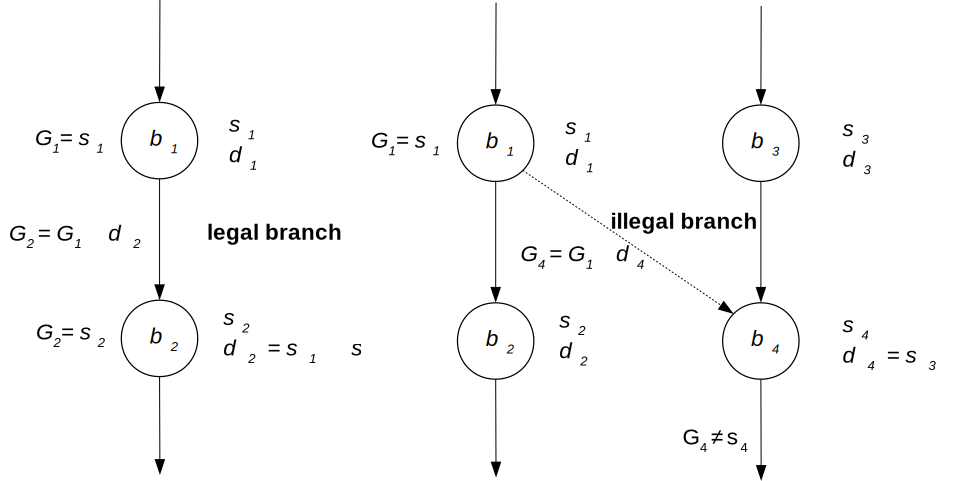
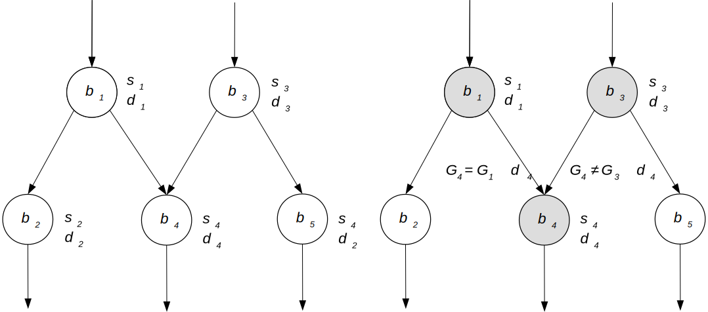
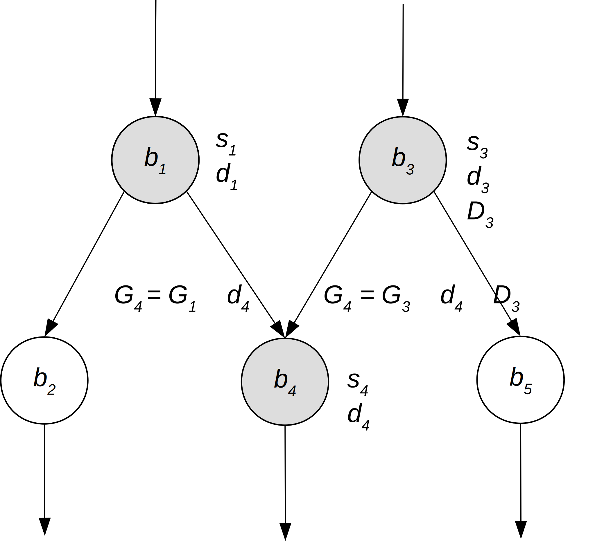
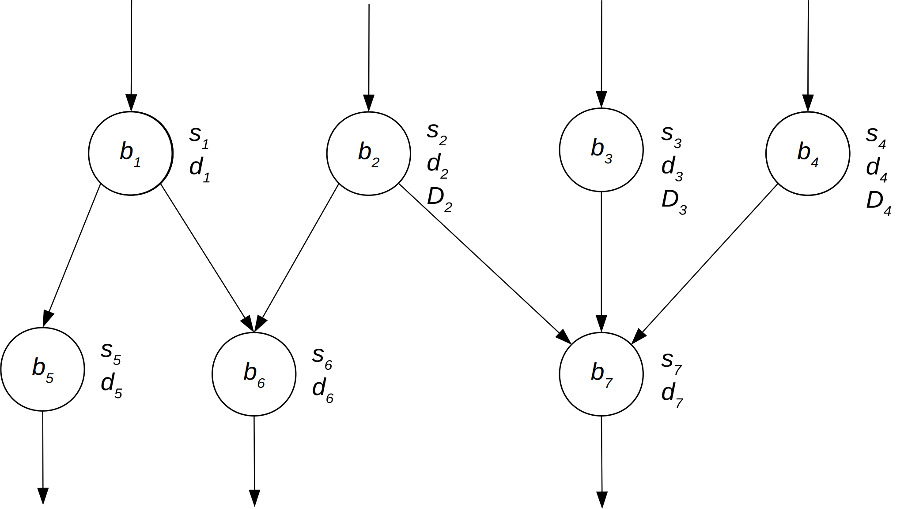
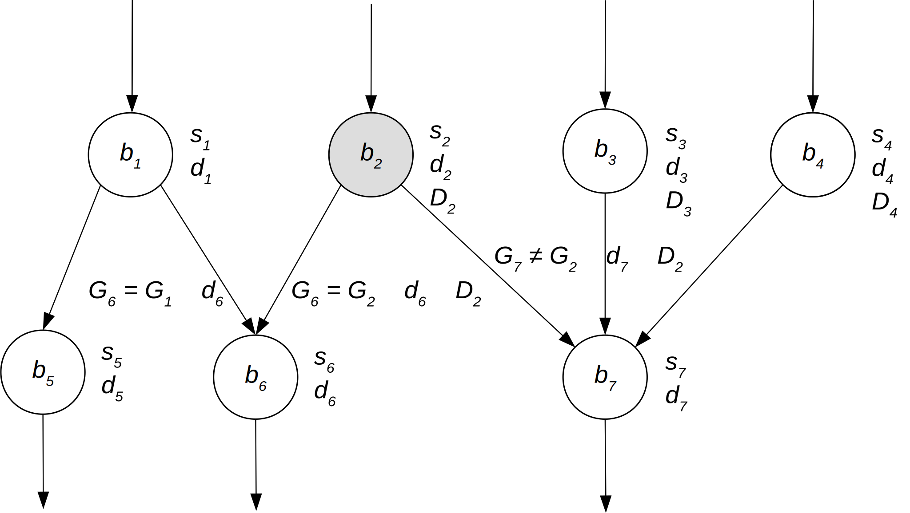
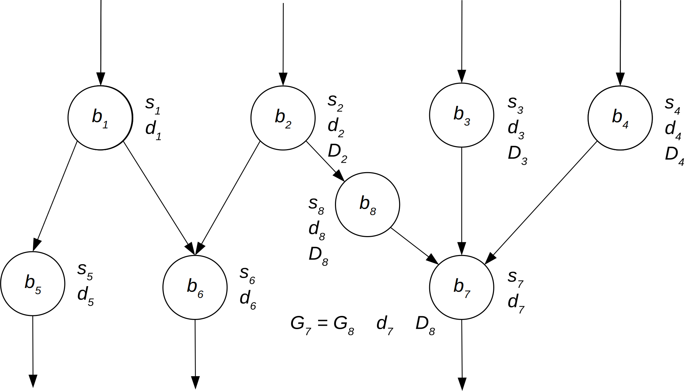
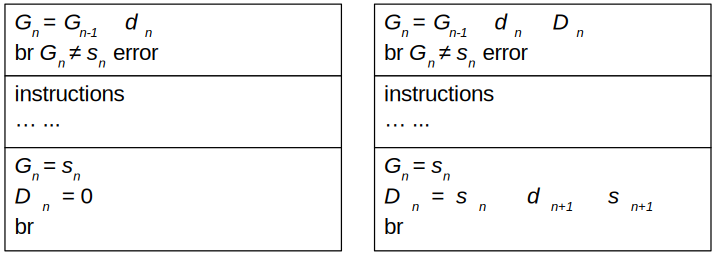

.. include:: substitutions.inc

Control Flow Checking via Software Signatures (CFCSS)
*******************************************************

Introduction
=============

As part of our research into software error mitigation, we recognized the necessity of checking for control flow errors along with dataflow errors.

Previous Work
===============

Control-flow checking by software signatures [#f1]_

Algorithm
=========

The algorithm we determined to use is one found in the research paper mentioned above. A brief description will be included here.

A program may be split into a representation using ”basic blocks.” A basic block (|bn|) is a collection of sequential instructions, into which there is only one entry point, and out of which there is only one exit point. Many basic blocks may branch into a single basic block, and a single basic block may branch out to many others. The process of ensuring that these transitions between basic blocks are legal is called Control Flow Checking. A legal transition is defined as one that is allowed by the control flow graph determined at compile time before the program is run.

At compile time, a graph is generated showing all legal branches. Each basic block is represented by a node. A unique signature (|sn|) is assigned to each basic block. Along with this, a signature difference (|dn|) is assigned to each basic block, which is calculated by taking the bit-wise XOR (|xor|) of the current block and its successor. When the program is run, a run-time signature tracker (|Gn|) is updated with the signature of the current basic block. When the program branches to a new basic block, the signature tracker is XOR’d with the signature difference of the new block:

    :math:`G_n \oplus s_n = d_n`

Because the XOR operation can undo itself, the result should equal the signature of the current block. If it does not, then a control flow error has been detected.

.. _fig1:

    correct vs incorrect branching

Branch Fan-in
---------------

There is a danger when dealing with dense control flow graphs that there will be a configuration as seen in :numref:`fig2`

.. _fig2:

    branch fan-in problem

If |b1| and |b3| are assigned the same signature, then there will be no issue branching to |b4| . However, this opens up the possibility for illegal branching from |b1| to |b5| without being caught. If all signatures are generated randomly, without any duplicates, then |b4| will register correct branching from either |b1| or |b3| , but not both.

This necessitates the addition of the run-time signature adjuster. |Dn| This is an additional number that is calculated at compile time for each basic block, then updated as the program executes. It is used to adjust for the differences created by this branch fan-in problem.

.. _fig3:

    run-time signature adjuster

In the case of the branch from |b1| to |b4| , the signature adjuster will be 0. In the case of the branch from |b3| to |b4| , the signature adjuster will be

    :math:`D_3 = s_3 \oplus d_4 \oplus s_4`

such that

    :math:`G_4 = G_3 \oplus d_4 \oplus D_3`

Modifications
==============

Although the algorithm described above is very robust, there were some instances where it does not perform correctly. If a node has two successors which are themselves both branch fan-in nodes (as in :numref:`fig4`), the algorithm will correctly assign a signature adjuster value for one branch, but not for the other.

.. _fig4:

    multiple successors with branch fan-in

.. _fig5:

    run-time signature adjuster error

To solve this problem, we determined to insert an extra basic block to act as a buffer. This would go between the predecessor with the invalid signature adjuster and the successor that is the branch fan-in node (see :numref:`fig6`) It would contain no instructions other than those that verify proper control flow. Because this buffer block would only have one predecessor, it would not need to use the signature adjuster, whatever the value might be. The value for :math:`D_8` for the buffer block would be determined to allow correct branching to the successor node.

.. _fig6:

    using the buffer block

Implementation
==================

We implemented this algorithm using LLVM. It was implemented as a pass that the optimizer runs before the back-end compiles the assembly into machine code. This particular implementation worked very well with the algorithm, because LLVM automatically splits its programs into basic blocks. One of the challenges this presented was compiling for a 16-bit microprocessor. In order to save space, the signatures were generated as unsigned 16-bit numbers. This gives 65,535 possible signatures to use, which far surpasses the number of basic blocks you could fit in such a small memory space as we had on our device.

To deal with the multiple fan-in successor problem mentioned above, we ran the signature generation step as normal. Then we checked the entire graph to see if there were any mismatched signatures. If there were, we inserted a buffer block to deal with that problem and updated the surrounding blocks to match the new block.

To implement the control flow checking, we inserted a set of instructions at the beginning of each basic block to do the XOR operation specified above. We also inserted instructions at the end of each block to update the run-time signature tracker to be the signature of the block about to be left.

.. _fig7:

    inserting instructions into basic blocks

One of the optimizations we used was to only insert the extra XOR operation when :math:`D_n−1` was :math:`\neq 0`. This is one reason why the buffer block fix worked.

.. rubric:: Footnotes

.. [#f1] N. Oh, P. P. Shirvani, and E. J. McCluskey, "Control-flow checking by software signatures," *IEEE Transactions on Reliability*\ , vol. 51, no. 1, pp. 111–122, Mar. 2002.
