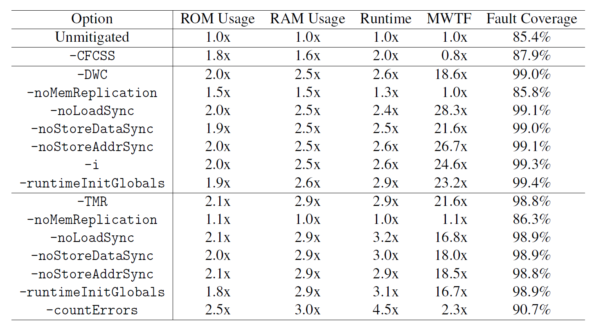
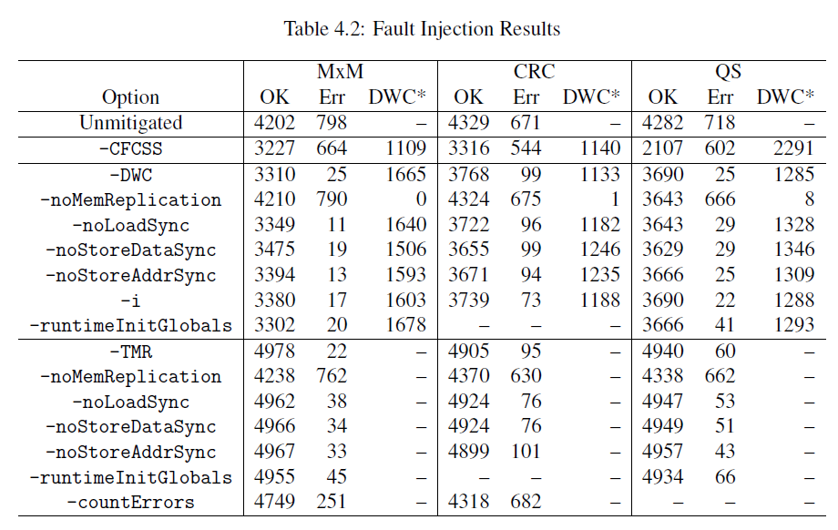
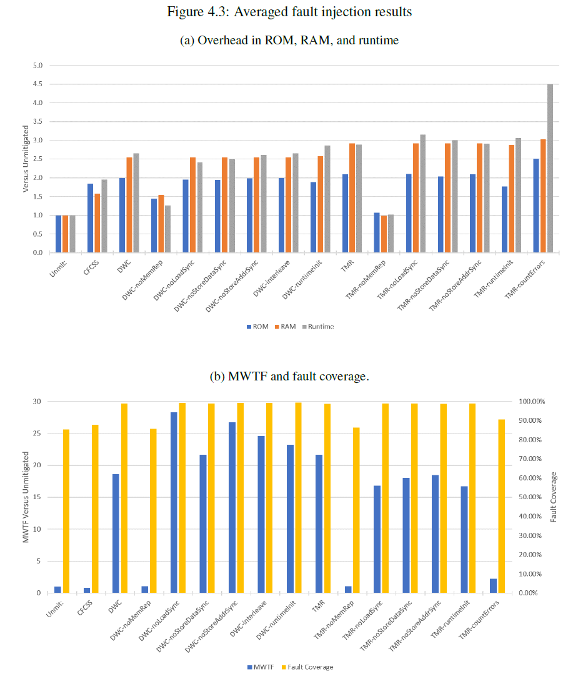
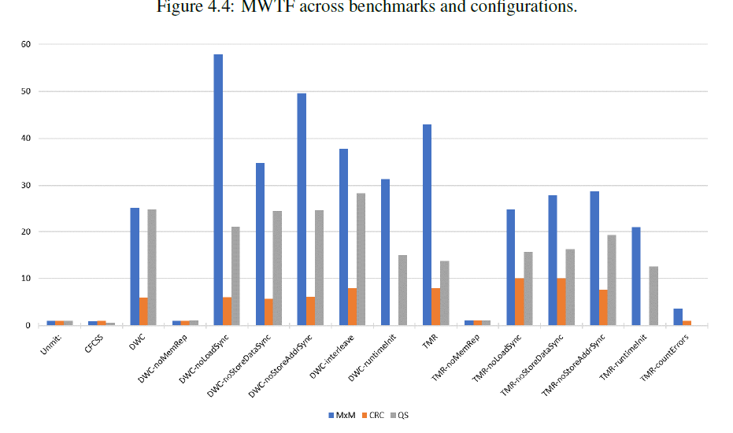

.. This page shows results from the fault injection campaigns done on the MSP430

MSP430
********

The current results are shown below. Detailed descriptions of the benchmarks, methodology, and analysis of the results are available in Matthew Bohman's `Master's thesis`_.

.. _Master's thesis: https://scholarsarchive.byu.edu/cgi/viewcontent.cgi?article=7724&context=etd

